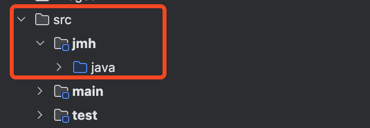

# 자바 성능측정 도구 JMH

## JMH란?
JMH(Java Microbenchmark Harness)는 JVM 기반 언어(주로 Java, Kotlin)에서 정확한 성능 측정을 위해 OpenJDK 팀이 개발한 벤치마크 프레임워크입니다. 일반적인 벤치마크 수행 시 발생할 수 있는 다양한 함정들을 피하고 신뢰할 수 있는 성능 측정 결과를 제공합니다.

## 설정 방법

### 1. Gradle 설정
build.gradle.kts 파일에 JMH 플러그인 추가
``` kotlin
plugins {
    id("java")
    id("me.champeau.jmh") version "0.7.2" // JMH 플러그인 추가
}
```

### 2.별도의 jmh 디렉토리 생성



### 3. 벤치마크 실행
프로젝트 루트 디렉토리에서 다음의 명령어 실행
```shell
./gradlew jmh
```

## 벤치마크 수행 결과 해석
테스트가 끝나면 기본적으로 `./build/results/jmh` 경로에 `result.txt` 파일이 생성된다.

**result.txt**
```txt
Benchmark                                                            Mode    Cnt    Score     Error   Units
StringConcatBenchmark.testString                                    thrpt      2    0.004            ops/ms
StringConcatBenchmark.testStringBuffer                              thrpt      2   13.436            ops/ms
StringConcatBenchmark.testStringBuilder                             thrpt      2   13.164            ops/ms
StringConcatBenchmark.testString                                     avgt      2  213.161             ms/op
StringConcatBenchmark.testStringBuffer                               avgt      2    0.088             ms/op
StringConcatBenchmark.testStringBuilder                              avgt      2    0.078             ms/op
StringConcatBenchmark.testString                                   sample      8  305.496 ± 450.178   ms/op
StringConcatBenchmark.testString:testString·p0.00                  sample         204.472             ms/op
StringConcatBenchmark.testString:testString·p0.50                  sample         212.206             ms/op
StringConcatBenchmark.testString:testString·p0.90                  sample         886.047             ms/op
StringConcatBenchmark.testString:testString·p0.95                  sample         886.047             ms/op
StringConcatBenchmark.testString:testString·p0.99                  sample         886.047             ms/op
StringConcatBenchmark.testString:testString·p0.999                 sample         886.047             ms/op
StringConcatBenchmark.testString:testString·p0.9999                sample         886.047             ms/op
StringConcatBenchmark.testString:testString·p1.00                  sample         886.047             ms/op
StringConcatBenchmark.testStringBuffer                             sample  25954    0.077 ±   0.001   ms/op
StringConcatBenchmark.testStringBuffer:testStringBuffer·p0.00      sample           0.072             ms/op
StringConcatBenchmark.testStringBuffer:testStringBuffer·p0.50      sample           0.074             ms/op
StringConcatBenchmark.testStringBuffer:testStringBuffer·p0.90      sample           0.079             ms/op
StringConcatBenchmark.testStringBuffer:testStringBuffer·p0.95      sample           0.082             ms/op
StringConcatBenchmark.testStringBuffer:testStringBuffer·p0.99      sample           0.111             ms/op
StringConcatBenchmark.testStringBuffer:testStringBuffer·p0.999     sample           0.521             ms/op
StringConcatBenchmark.testStringBuffer:testStringBuffer·p0.9999    sample           3.790             ms/op
StringConcatBenchmark.testStringBuffer:testStringBuffer·p1.00      sample           5.939             ms/op
StringConcatBenchmark.testStringBuilder                            sample  25270    0.079 ±   0.002   ms/op
StringConcatBenchmark.testStringBuilder:testStringBuilder·p0.00    sample           0.072             ms/op
StringConcatBenchmark.testStringBuilder:testStringBuilder·p0.50    sample           0.075             ms/op
StringConcatBenchmark.testStringBuilder:testStringBuilder·p0.90    sample           0.080             ms/op
StringConcatBenchmark.testStringBuilder:testStringBuilder·p0.95    sample           0.084             ms/op
StringConcatBenchmark.testStringBuilder:testStringBuilder·p0.99    sample           0.134             ms/op
StringConcatBenchmark.testStringBuilder:testStringBuilder·p0.999   sample           0.569             ms/op
StringConcatBenchmark.testStringBuilder:testStringBuilder·p0.9999  sample           5.286             ms/op
StringConcatBenchmark.testStringBuilder:testStringBuilder·p1.00    sample          10.781             ms/op
StringConcatBenchmark.testString                                       ss      2  251.984             ms/op
StringConcatBenchmark.testStringBuffer                                 ss      2    0.888             ms/op
StringConcatBenchmark.testStringBuilder                                ss      2    0.794             ms/op
```

|컬럼명|설명|
|---|---|
|`Benchmark`|벤치마크 메서드 이름|
|`Mode`|측정 방식 (`thrpt`, `avgt`, `sample`, `ss`)|
|`Cnt`|측정 반복 횟수 (`@Measurement(iterations)`)|
|`Score`|측정된 성능 수치 (처리량 or 응답 시간 등)|
|`Error`|오차범위 (±), 신뢰도 지표|
|`Units`|단위 (`ops/ms`, `ms/op` 등)|


### **Throughput (`thrpt`)**

- 의미: **1밀리초당 몇 번 실행되었는가 (ops/ms)**


|메서드|처리량 (ops/ms)|의미|
|---|---|---|
|`testString`|0.004|매우 느림 (문자열 `+` 연산)|
|`testStringBuffer`|13.436|빠름|
|`testStringBuilder`|13.164|빠름|

> **`+` 연산은 압도적으로 느리고**, `StringBuilder`와 `Buffer`는 유사한 처리량을 확인할 수 있다.

### **Average Time (`avgt`)**

- 의미: **1회 수행하는 데 걸리는 평균 시간 (ms/op)**


|메서드|평균 시간 (ms/op)|
|---|---|
|`testString`|213.161 ms|
|`testStringBuffer`|0.088 ms|
|`testStringBuilder`|0.078 ms|

> 문자열 덧셈 `+`는 **단일 처리에도 213ms 소요**, `Builder`는 **0.07ms로 훨씬 빠름**

### **Sample Time (`sample`)**

- 의미: **여러 실행을 샘플링하여 퍼센타일 등 통계 제공**


#### 💡 `testString`

- 평균: 305.496ms (오차 큼)

- p50 (중앙값): 212.206ms

- p99 이상: 886ms → 매우 높은 편차


#### 💡 `testStringBuilder`

- 평균: 0.079ms

- p99: 0.134ms

- **p1.00: 10.781ms** → 드물게 매우 느린 케이스 발생


> → **평균은 빠르지만**, 일부 요청에서는 **GC나 힙 압박으로 인한 outlier** 존재

---

### 4. **Single Shot (`ss`)**

- 의미: **1회만 실행한 시간 (cold start 성능 등)**


|메서드|단발 실행 시간|
|---|---|
|`testString`|251.984ms|
|`testStringBuffer`|0.888ms|
|`testStringBuilder`|0.794ms|

> 단발 측정에서도 **StringBuilder는 약 300배 빠름**


## 최종 요약

|메서드|처리량 (ops/ms)|평균 시간 (ms/op)|비고|
|---|---|---|---|
|`+` 연산|0.004|213~250ms|**가장 느림**, 편차 큼|
|`StringBuffer`|13.4|~0.08ms|Thread-safe (synchronized)|
|`StringBuilder`|13.1|~0.07ms|가장 빠르고 일반적으로 권장됨|

## 결론

- 문자열을 반복 연결할 때는 절대 `+` 연산 사용 금지

- 성능이 중요한 경우에는 **`StringBuilder` 사용**, 멀티스레드 환경에서는 Thread-Safe한 `StringBuffer` 사용

- 퍼센타일 결과를 보면, GC나 일시적인 힙 압박에 따른 성능 편차도 고려 필요.
